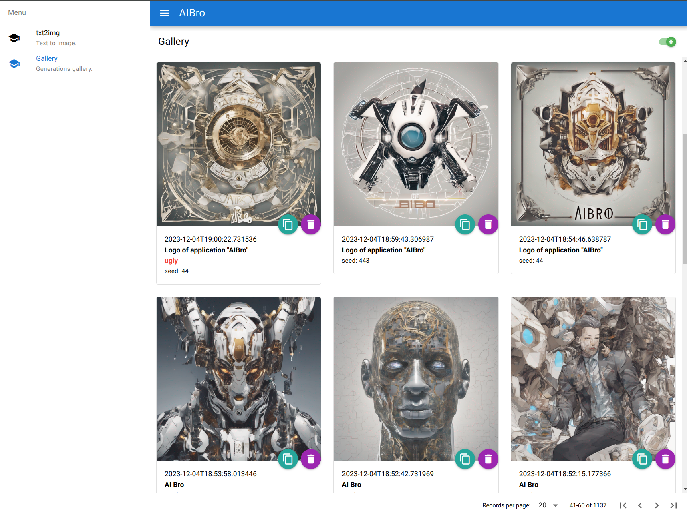
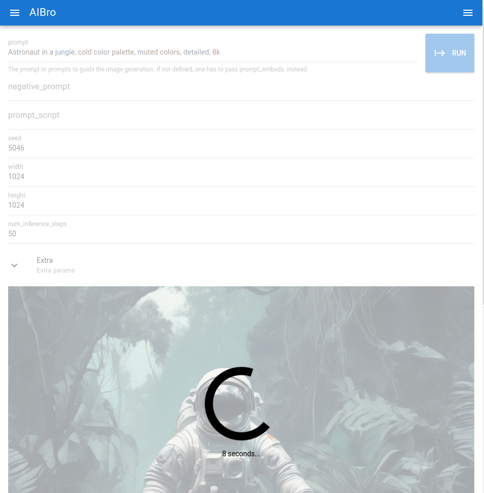
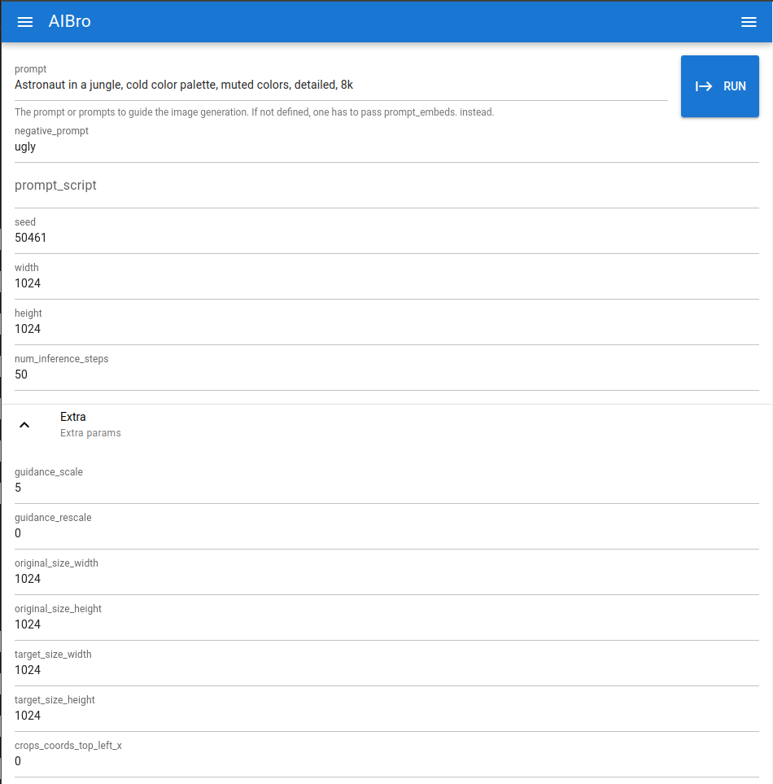
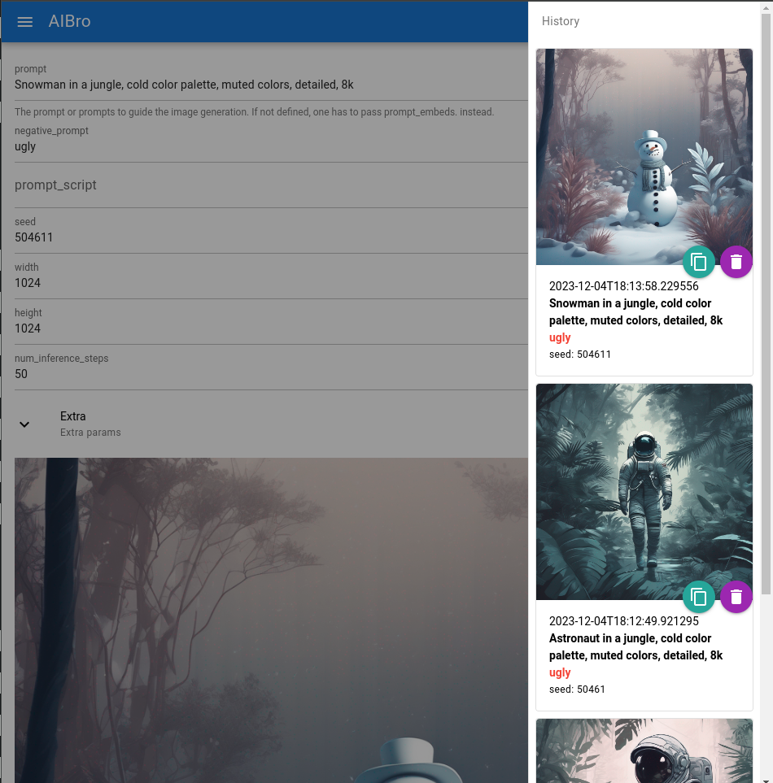

# AIBro


<p align="center">
    
</p>


My ML tool.

- [x] StableDiffusion XL txt2img generator
- [x] Prompt script
- [x] Gallery

Run:

```
pip install -r requirements.txt
uvicorn aibro:Api --host 0.0.0.0 --port 7002 --workers 1
```

Docker run:

```
docker run -it --rm --gpus=all -v $(pwd)/output:/app/output -p 8002:8002 r.sheff.online/library/aibro
```







